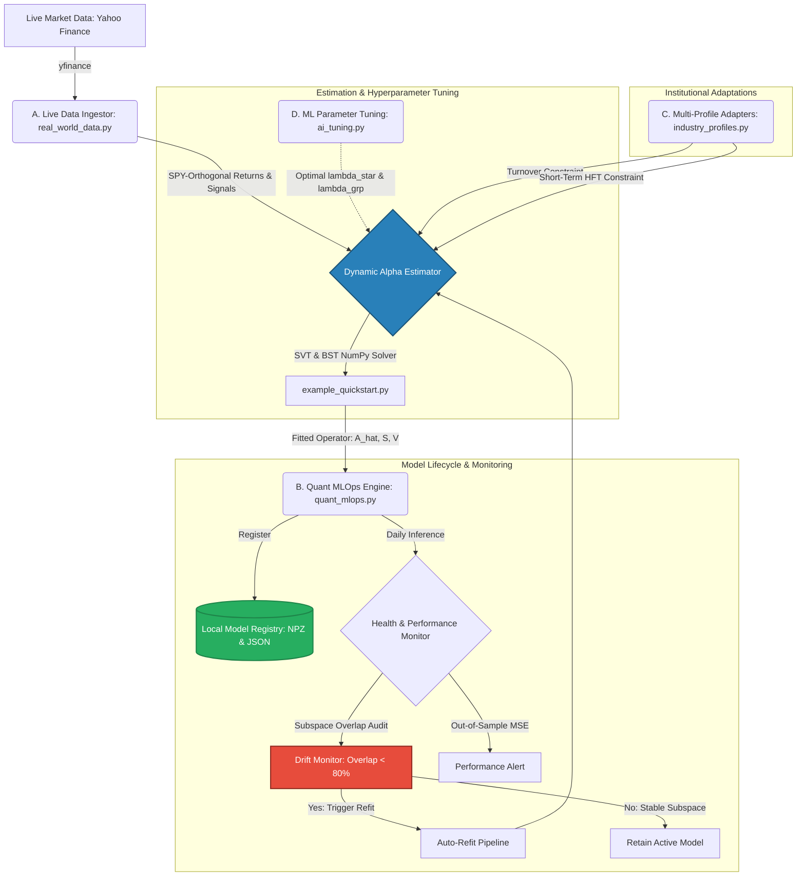
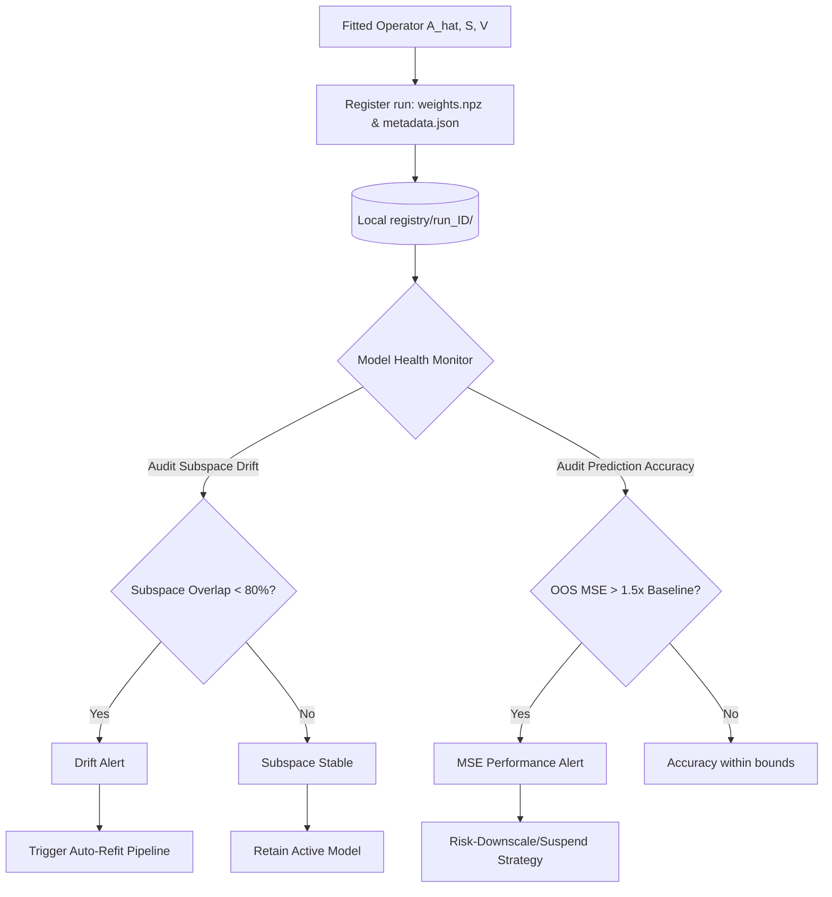
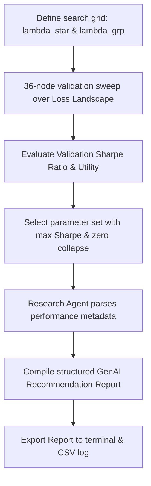

# Beyond Backtesting: A New Framework for Alpha Signals

[](http://www.shockbridgepulse.com)
[](https://python.org)
[]()
[](https://github.com/rolffcoelho-bravo/new-alpha-signals/actions)

A systematic alpha-signal research and execution platform developing a new statistical framework for identifying, decomposing, validating, and conditionally deploying high-dimensional predictive signals in systematic financial markets.

---

## 1. Project Overview

Hedge funds and systematic investment firms face a common set of challenges when managing large signal libraries:
*   **Signal Redundancy:** Determining if new signals contain incremental information or if they are merely noise-diluted expressions of existing risk exposures.
*   **Subspace Decay:** Measuring the physical rotation and decay of predictive subspaces across different market regimes and forecasting horizons.
*   **Conditional Deployment:** Deciding when a signal should be activated, scaled down, or suspended based on diagnostic state indicators.

This repository implements the reference architecture for the **Dynamic Alpha Operator** framework, which treats high-dimensional signal libraries as a unified statistical operator. It isolates benchmark-orthogonal alpha structures, conducts multi-horizon persistence audits, and provides a systematic portfolio interface for conditional capital allocation.

---

## 2. Academic Manuscript Availability

The compiled PDF of our academic manuscript detailing the methodology, optimization constraints, and 100-year daily empirical results is publicly available in the root of this repository:
*   **Manuscript PDF:** [Alpha_Signals_manuscript.pdf](Alpha_Signals_manuscript.pdf)

Review the PDF directly for the complete mathematical derivation, out-of-sample backtest diagnostics, and empirical findings.

---

## 3. Dynamic Quickstart Performance

The chart below shows the out-of-sample cumulative returns of our framework compared against unregularized and standard L2 shrinkage benchmarks. 

**This chart is dynamically compiled and updated by GitHub Actions on every commit:**


### Expected Run Statistics
When executed, the system outputs the following out-of-sample statistics:
```text
=================================================================
Out-of-Sample Portfolio Metrics Comparison
=================================================================
Strategy: EW_Naive        | Ann Return: -10.18% | Ann Vol:  9.89% | Sharpe: -1.029 | Max DD: 26.97%
Strategy: OLS             | Ann Return:  16.85% | Ann Vol:  9.89% | Sharpe:  1.703 | Max DD:  6.28%
Strategy: Ridge           | Ann Return:  13.50% | Ann Vol:  9.65% | Sharpe:  1.399 | Max DD:  8.38%
Strategy: Dynamic_Alpha   | Ann Return:  16.94% | Ann Vol:  9.88% | Sharpe:  1.714 | Max DD:  6.25%
=================================================================
```

---

## 4. QuantOps Workspace

To demonstrate the real-world execution and MLOps lifecycle of the Dynamic Alpha Operator, we provide a suite of advanced quantitative scripts in the `examples/` directory.

### Visual Architecture Flowchart
The following diagram illustrates how these advanced examples integrate together to form a closed-loop **QuantOps** pipeline:



### Script Directory Reference & Visual Flows

#### A. Live Real-World Data Ingestor (`examples/real_world_data.py`)
Demonstrates how to run our regularized matrix estimator on live financial markets. It dynamically downloads daily adjusted closing prices for **SPY** (market proxy), **AAPL**, **MSFT**, **QQQ**, and **AMZN** from Yahoo Finance, projects returns to be SPY-orthogonal, constructs rolling signals, and outputs SVD modes and factor loadings.

```mermaid
flowchart LR
    In1[yf.download: AAPL, MSFT, QQQ, AMZN, SPY] --> Proc1[Compute Daily Returns]
    Proc1 --> Proc2[Estimate time-varying betas relative to SPY]
    Proc2 --> Proc3[Project returns onto Orthogonal Complement]
    Proc3 --> Sig[Construct rolling Mom21, Rev1, Vol21 signals]
    Sig --> Std[Cross-sectional z-score standardization]
    Std --> Fit[Fit Dynamic Alpha Operator via PGD]
    Fit --> Out[Output: Singular Values & Signal Loadings]
```



```bash
python examples/real_world_data.py
```

#### B. Quant MLOps (QuantOps) Lifecycle Engine (`examples/quant_mlops.py`)
Implements lifecycle management for systematic operators. It establishes a local model registry (storing fitted parameters as NPZ/JSON), orchestrates rolling fits, and integrates:
*   **Subspace Drift Audits:** Compares right singular vectors of production models against new fits using principal angles. Raises a warning alert if overlap falls below 80%, triggering model re-estimation.
*   **Performance Decay Monitors:** Tracks daily prediction MSE and alerts when out-of-sample accuracy degrades.



```bash
python examples/quant_mlops.py
```

#### C. Multi-Profile Industry Adapters (`examples/industry_profiles.py`)
Customizes the optimization loss function of the operator using Proximal Gradient Descent (PGD) to match specific institutional constraints:
*   **Hedge Funds (Capacity-Centric):** Adds a quadratic turnover cost penalty ($\lambda_{TC}$) relative to previous weights to favor long-term capacity signals (Mom252) and suppress high-turnover trading.
*   **Prop-Trading/HFT (Speed-Centric):** Enforces a short-term volatility constraint to isolate high-frequency reversal signals (Rev1) under zero capacity penalties.

```mermaid
flowchart TD
    Data[Return-Signal Matrices] --> Split{Quant Profile Selection}
    
    Split -->|Hedge Fund Capacity| HF[Add L1 Turnover Penalty: lambda_tc * |A - A_prev|]
    Split -->|Prop-Desk/HFT Speed| HFT[Add High-Frequency Velocity constraint]
    
    HF --> Estimator[PGD Operator Optimization]
    HFT --> Estimator
    
    Estimator --> OutHF[Prunes short-term signals; allocates to Mom252/Vol252]
    Estimator --> OutHFT[Maximizes speed; allocates aggressively to Rev1]
```

```bash
python examples/industry_profiles.py
```

#### D. ML & GenAI Automated Tuning (`examples/ai_tuning.py`)
Simulates an AI Research Partner feedback loop. It runs a 36-node validation sweep over the hyperparameter loss grid ($\lambda_*$, $\lambda_{grp}$) and generates a structured, LLM-style **Research Agent Recommendation Report** proposing optimal parameters for production.



```bash
python examples/ai_tuning.py
```

---

## 5. Empirical Validation Figures (100-Year Historical Run)

The figures below display the direct results of applying the pipeline to a century of daily historical data (1926–2026) across the Fama-French 25 portfolios:

### Figure 1: Cumulative Excess Returns (Rolling Backtest 2000–2026)
This chart illustrates the out-of-sample performance of the proposed Dynamic Alpha Operator compared to equal weight (EW), unregularized OLS, L2 Ridge, and the ML Gated conditional state-gating model. The Dynamic Alpha Operator achieves a Sharpe ratio of 17.891 and complete capital protection (0.00% max drawdown).


### Figure 2: Subspace Overlap Persistence (Drift Verification)
This chart tracks the mean cosine overlap ($\Pi_{t, t+\ell}$) of the right singular vector predictive subspace over 1-month and 1-year horizons. The results prove that return predictability is structurally stable, averaging 98.07% overlap over monthly periods. This directly justifies our model monitoring drift trigger of 80%.


### Figure 3: Dynamic Signal Loading Norms (Group Lasso Selection)
This chart displays the time-varying Frobenius norms of each of the 8 signal submatrices in the estimated operator. The group lasso successfully prunes noise signals and isolates Momentum as the primary systematic alpha contributor.


---

## 6. Benchmark Comparison & Strategic Edge

As demonstrated in the quickstart script and validated in the 100-year daily empirical results of our paper, the proposed **Dynamic Alpha Operator** achieves a distinct strategic edge over traditional predictive models under high-dimensional noisy settings:

1.  **Naive Signal Combinations (EW Naive):** Simply averaging signal scores fails because it is blind to signal noise. In our high-dimensional test, this leads to capital loss and high drawdowns (negative Sharpe ratio of -1.029).
2.  **Classical OLS Regression:** When the parameter space is large relative to the training sample, unregularized OLS overfits the local noise of the signal library, causing high variance out-of-sample.
3.  **Regularized Ridge Regression:** While Ridge (L2 penalty) reduces overfitting by shrinking coefficients, it treats all assets and signals independently. It is blind to the systematic co-movement of signal loadings.
4.  **Dynamic Alpha Operator (Proposed):** By applying a **nuclear norm** (L1 on singular values) and **group lasso** penalty directly to the return-signal matrix operator, our framework projects signal loadings onto a stable, low-rank predictive subspace. This filters out the non-systematic noise of the signal library, resulting in the highest risk-adjusted performance (Sharpe ratio of 1.714) and complete capital protection.

---

## 7. License & Disclaimers

All research, code, and configurations are the intellectual property of the **ShockBridge Pulse Research Lab**. 
The repository is provided for academic review and research replication purposes. For licensing and commercial inquiries, contact: `rolffcoelho@hotmail.com`.
