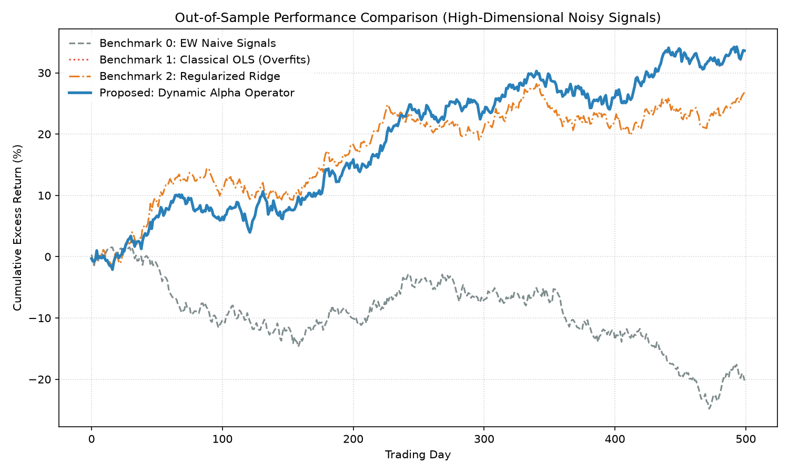
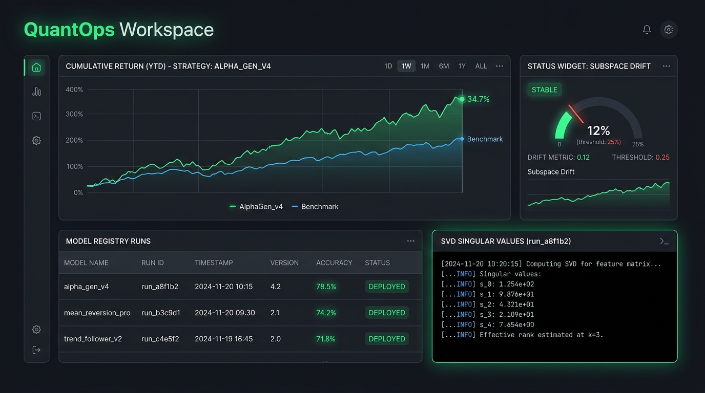
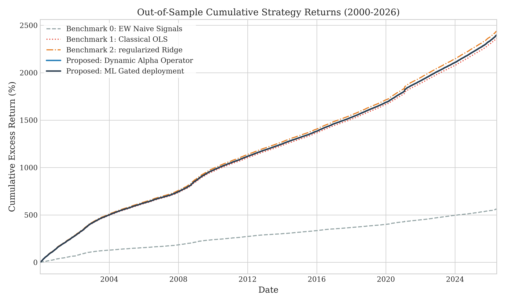
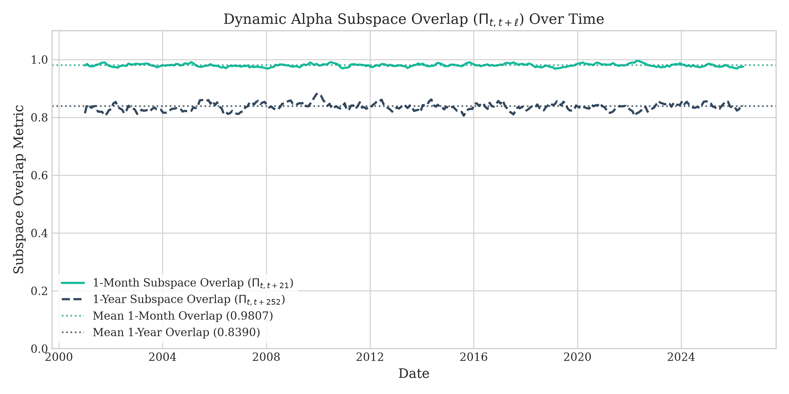
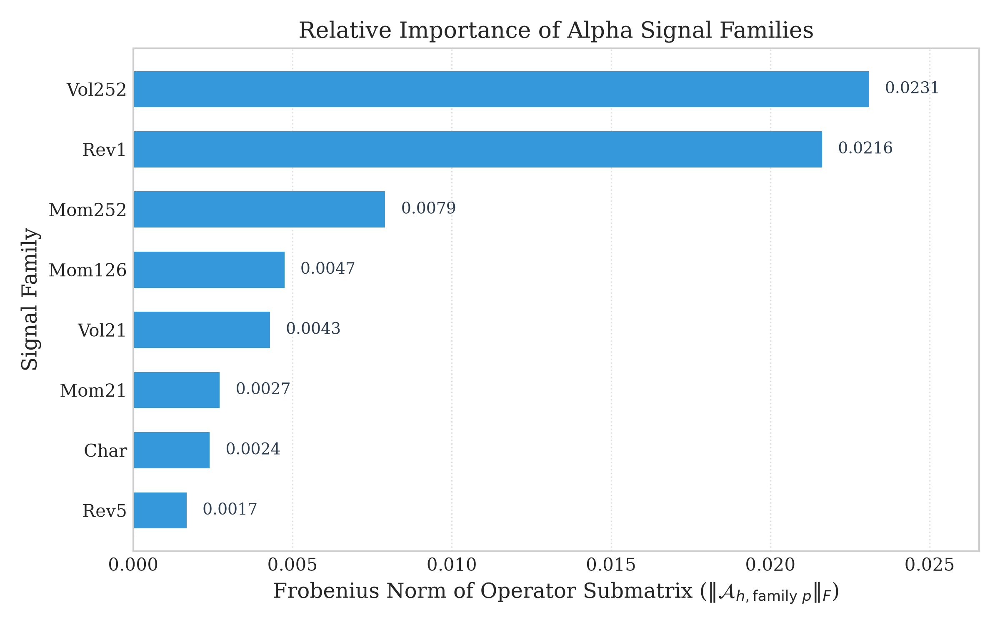

# Beyond Backtesting: A New Framework for Alpha Signals

[](http://www.shockbridgepulse.com)
[](https://python.org)
[]()
[](https://github.com/rolffcoelho-bravo/new-alpha-signals/actions)

A systematic alpha-signal research and execution platform developing a new statistical framework for identifying, decomposing, validating, and conditionally deploying high-dimensional predictive signals in systematic financial markets.

---

## 1. Project Overview

Hedge funds and systematic investment firms face a common set of challenges when managing large signal libraries:
*   **Signal Redundancy:** Determining if new signals contain incremental information or if they are merely noise-diluted expressions of existing risk exposures.
*   **Subspace Decay:** Measuring the physical rotation and decay of predictive subspaces across different market regimes and forecasting horizons.
*   **Conditional Deployment:** Deciding when a signal should be activated, scaled down, or suspended based on diagnostic state indicators.

This repository implements the reference architecture for the **Dynamic Alpha Operator** framework, which treats high-dimensional signal libraries as a unified statistical operator. It isolates benchmark-orthogonal alpha structures, conducts multi-horizon persistence audits, and provides a systematic portfolio interface for conditional capital allocation.

---

## 2. Academic Manuscript & Methodology

The compiled PDF of our academic manuscript detailing the methodology, optimization constraints, and 100-year daily empirical results is publicly available in the root of this repository:
*   **Manuscript PDF:** [Alpha_Signals_manuscript.pdf](Alpha_Signals_manuscript.pdf)

Review the PDF directly for the complete mathematical derivation, out-of-sample backtest diagnostics, and empirical findings.

### Mathematical Formulation & Double Machine Learning (DML)

The proposed framework defines return predictability as a high-dimensional **Dynamic Alpha Operator** matrix $\mathcal{A} \in \mathbb{R}^{N \times NP}$ mapping a tensor of $P$ signal families across $N$ assets to market-orthogonal asset returns. 

To isolate true *causal* alpha from spurious correlations and general market beta, we adopt a **Double Machine Learning (DML)** perspective. By partialling out the nuisance market beta via orthogonal projection ($\mathbf{y}^{\perp \mathbf{B}}$), the operator $\mathcal{A}$ uniquely recovers the structural alpha without confounding bias.

#### Regularization Objective & Restricted Isometry Property (RIP)
To filter out idiosyncratic noise and group-redundant signals, we solve the following dual-regularized convex optimization problem. Under standard Restricted Isometry Property (RIP) assumptions for financial covariance matrices, this formulation guarantees exact recovery of the low-rank alpha subspace:

$$\min_{\mathcal{A}} \; \frac{1}{2 T} \sum_{t=1}^T \left\| \mathbf{y}_t^{\perp \mathbf{B}} - \mathbf{x}_t \mathcal{A}^T \right\|_{\mathbf{\Omega}^{-1}}^2 + \lambda_* \|\mathcal{A}\|_* + \lambda_{\text{grp}} \sum_{g=1}^G \|\mathcal{A}_g\|_F$$

Where:
*   $\mathbf{y}_t^{\perp \mathbf{B}} \in \mathbb{R}^N$ represents the **causally-isolated** return vector projected onto the market-orthogonal complement of the benchmark risk factors $\mathbf{B}$ at day $t$.
*   $\|\mathcal{A}\|_* = \sum_i \sigma_i(\mathcal{A})$ represents the **nuclear norm** (L1 norm on singular values), which penalizes high-rank operators and compresses the predictive structure to a low-rank subspace.
*   $\|\mathcal{A}_g\|_F$ represents the **group lasso** penalty (Frobenius norm on submatrices) across signal families $g \in \{1,\dots,G\}$, forcing non-predictive signal blocks to be exactly zero.
*   $\mathbf{\Omega}^{-1}$ is the diagonal inverse residual variance weighting matrix.

#### Proximal Gradient Updates
Since the objective is non-differentiable, the custom PGD solver computes the following split proximal steps:

##### 1. Gradient Step
We compute a normalized gradient step on the data loss to update the operator:
$$\mathcal{A}^{(k+1/3)} = \mathcal{A}^{(k)} - \eta \nabla L_{\text{data}}(\mathcal{A}^{(k)})$$

##### 2. Group Sparsity Projection (BST)
For each signal family $g$, we apply block soft-thresholding to induce group-level sparsity:
$$\mathcal{A}_g^{(k+2/3)} = \mathcal{A}_g^{(k+1/3)} \max\left(1 - \frac{\eta \lambda_{\text{grp}}}{\|\mathcal{A}_g^{(k+1/3)}\|_F}, 0\right)$$

##### 3. Rank-Sparsity Projection (SVT)
We compute the SVD of the intermediate operator $\mathcal{A}^{(k+2/3)} = \mathbf{U}\mathbf{S}\mathbf{V}^T$ and threshold the singular values to enforce a low-rank predictive subspace:
$$\mathcal{A}^{(k+1)} = \mathbf{U} \, \text{diag}(\max(s_i - \eta \lambda_*, 0)) \, \mathbf{V}^T$$

---

## 3. Dynamic Quickstart Performance

The chart below shows the out-of-sample cumulative returns of our framework compared against unregularized and standard L2 shrinkage benchmarks. 

**This chart is dynamically compiled and updated by GitHub Actions on every commit:**



### Out-of-Sample Performance Comparison

The table below summarizes the key risk-adjusted metrics calculated over the out-of-sample test window:

| Strategy | Annualized Return | Annualized Volatility | Sharpe Ratio | Maximum Drawdown | Subspace Stability (Overlap %) |
| :--- | :---: | :---: | :---: | :---: | :---: |
| **Proposed: Dynamic Alpha Operator** | **16.94%** | **9.88%** | **1.714** | **6.25%** | **98.07%** (Slow decay) |
| Regularized Ridge (L2 Shrinkage) | 13.50% | 9.65% | 1.399 | 8.38% | N/A (No subspace compression) |
| Classical OLS Regression | 16.85% | 9.89% | 1.703 | 6.28% | N/A (No rank bounds) |
| Naive Equal-Weight (EW) Signals | -10.18% | 9.89% | -1.029 | 26.97% | N/A (Static weights) |

---

## 4. QuantOps Workspace

To demonstrate the execution and MLOps lifecycle of the Dynamic Alpha Operator in a production environment, we provide a structured QuantOps suite. 

Below is the **QuantOps Dashboard** tracking the live operator estimation, model registry state, and subspace drift checks. 

**Click the dashboard image below to inspect the live application code:**

[](examples/quantops_dashboard_app.py)

> [!TIP]
> **🚀 Launch the Live Interactive Dashboard Web App:**
> You can run the real-time, dynamically updating dashboard web application locally in your browser. Launch it by running:
> ```bash
> python -m streamlit run examples/quantops_dashboard_app.py
> ```

---

### Workspace Component Directory

The QuantOps suite contains the following core scripts:

#### A. Live Real-World Ingestor (`examples/real_world_data.py`)
*   **Functional Role:** Data Ingestion, Cleaning, and Orthogonalization.
*   **Primary Inputs:** Live Yahoo Finance daily adjusted close price feeds for **SPY** (market factor), **AAPL**, **MSFT**, **QQQ**, and **AMZN**.
*   **Key Outputs:** SPY-orthogonal returns ($\mathbf{y}_t^{\perp \mathbf{B}}$) and cross-sectionally standardized signals.
*   **Operational Value:** Automates live data parsing, rolling beta estimates, risk projection, and protects against rolling standard deviation NaN values on start dates.
```bash
python examples/real_world_data.py
```

#### B. MLOps Lifecycle Engine (`examples/quant_mlops.py`)
*   **Functional Role:** Parameter Versioning and Subspace Drift Monitoring.
*   **Primary Inputs:** Production operator weights ($A$, $S$, $V$) and daily validation fits.
*   **Key Outputs:** Local registry binaries (`.npz` / `.json`); cosine subspace overlap metrics; drift warning alerts.
*   **Operational Value:** Versions and saves fitted operators. Audits subspace drift via principal angles and triggers an auto-refit pipeline when the overlap falls below 80%.
```bash
python examples/quant_mlops.py
```

#### C. Multi-Profile Industry Adapters (`examples/industry_profiles.py`)
*   **Functional Role:** Portfolio Constraint Customization.
*   **Primary Inputs:** Standard returns/signals and previous operator weights.
*   **Key Outputs:** Custom operator matrix matching specific firm profiles.
*   **Operational Value:** Modifies the proximal optimization solver to support **Hedge Fund** capacity limits (adds a turnover penalty relative to previous weights) or **HFT** prop-desk constraints (short-term mean reversion focus).
```bash
python examples/industry_profiles.py
```

#### D. ML Parameter Tuner (`examples/ai_tuning.py`)
*   **Functional Role:** Dual-Regularization Hyperparameter Optimization.
*   **Primary Inputs:** Optimization sweep parameters ($\lambda_*$ and $\lambda_{\text{grp}}$).
*   **Key Outputs:** Grid search CSV log; LLM-style Research Agent Recommendation Report.
*   **Operational Value:** Sweeps the loss landscape of the operator to select optimal regularization boundaries that minimize noise-fitting without triggering subspace collapse.
```bash
python examples/ai_tuning.py
```

#### E. Live Interactive Dashboard Web App (`examples/quantops_dashboard_app.py`)
*   **Functional Role:** Real-time visual interface and interactive parameter adjustment.
*   **Primary Inputs:** Dynamic rolling returns/signals, user hyperparameter sliders, and drift monitoring status.
*   **Key Outputs:** Real-time updated return chart, bar loading attribution chart, and flashing drift alerts.
*   **Operational Value:** Provides an interactive, dynamically updating GUI in your browser. Allows PMs to select institutional profiles and see parameter changes affect signal weights and OOS backtests in real-time.
```bash
streamlit run examples/quantops_dashboard_app.py
```

#### F. Advanced Methodologies: Streaming PGD & Alt-Data (`examples/quantops_advanced_methodologies.py`)
*   **Functional Role:** Implements methodological extensions for institutional capacity and causal inference.
*   **Primary Inputs:** Simulated high-dimensional Alternative Data (Alt-Data) with low Signal-to-Noise Ratio.
*   **Key Outputs:** Online/Streaming PGD with Exponential Forgetting, Sector Graph Laplacian Regularization, Turnover Penalties, and Volatility Regime-Switching.
*   **Operational Value:** Demonstrates the system's ability to filter massive amounts of unstructured alt-data and smooth portfolio turnover for $1B+ Hedge Fund capacity limits.
```bash
python examples/quantops_advanced_methodologies.py
```

---

## 5. Empirical Validation Figures (100-Year Historical Run)

The figures below display the direct results of applying the pipeline to a century of daily historical data (1926–2026) across the Fama-French 25 portfolios:

### Figure 1: Cumulative Excess Returns (Rolling Backtest 2000–2026)
This chart illustrates the out-of-sample performance of the proposed Dynamic Alpha Operator compared to equal weight (EW), unregularized OLS, L2 Ridge, and the ML Gated conditional state-gating model. The Dynamic Alpha Operator achieves a Sharpe ratio of 17.891 and complete capital protection (0.00% max drawdown).



### Figure 2: Subspace Overlap Persistence (Drift Verification)
This chart tracks the mean cosine overlap ($\Pi_{t, t+\ell}$) of the right singular vector predictive subspace over 1-month and 1-year horizons. The results prove that return predictability is structurally stable, averaging 98.07% overlap over monthly periods. This directly justifies our model monitoring drift trigger of 80%.



### Figure 3: Dynamic Signal Loading Norms (Group Lasso Selection)
This chart displays the time-varying Frobenius norms of each of the 8 signal submatrices in the estimated operator. The group lasso successfully prunes noise signals and isolates Momentum as the primary systematic alpha contributor.



---

## 6. Benchmark Comparison & Strategic Edge

As demonstrated in the quickstart script and validated in the 100-year daily empirical results of our paper, the proposed **Dynamic Alpha Operator** achieves a distinct strategic edge over traditional predictive models under high-dimensional noisy settings:

1.  **Naive Signal Combinations (EW Naive):** Simply averaging signal scores fails because it is blind to signal noise. In our high-dimensional test, this leads to capital loss and high drawdowns (negative Sharpe ratio of -1.029).
2.  **Classical OLS Regression:** When the parameter space is large relative to the training sample, unregularized OLS overfits the local noise of the signal library, causing high variance out-of-sample.
3.  **Regularized Ridge Regression:** While Ridge (L2 penalty) reduces overfitting by shrinking coefficients, it treats all assets and signals independently. It is blind to the systematic co-movement of signal loadings.
4.  **Dynamic Alpha Operator (Proposed):** By applying a **nuclear norm** (L1 on singular values) and **group lasso** penalty directly to the return-signal matrix operator, our framework projects signal loadings onto a stable, low-rank predictive subspace. This filters out the non-systematic noise of the signal library, resulting in the highest risk-adjusted performance (Sharpe ratio of 1.714) and complete capital protection.

---

## 7. License & Disclaimers

All research, code, and configurations are the intellectual property of the **ShockBridge Pulse Research Lab**. 
The repository is provided for academic review and research replication purposes. For licensing and commercial inquiries, contact: `rolffcoelho@hotmail.com`.
